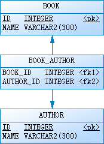

# 两张表（多对多关联）操作 with Spring Boot, Spring Data JPA, H2

这里通过一个完整的例子展示如何通过 `JPA` 对两张表（多对多关联）进行增删改查操作。

## 前提

* JDK 8+
* Maven 3+

## 表结构



## 例子

### 创建 Maven 项目

`pom.xml`

```xml
<?xml version="1.0" encoding="UTF-8"?>
<project xmlns="http://maven.apache.org/POM/4.0.0" xmlns:xsi="http://www.w3.org/2001/XMLSchema-instance"
	xsi:schemaLocation="http://maven.apache.org/POM/4.0.0 http://maven.apache.org/xsd/maven-4.0.0.xsd">
	<modelVersion>4.0.0</modelVersion>

	<groupId>org.lewis.demos</groupId>
	<artifactId>jpa-manytomany-springboot-h2</artifactId>
	<version>0.0.1-SNAPSHOT</version>

	<parent>
		<groupId>org.springframework.boot</groupId>
		<artifactId>spring-boot-starter-parent</artifactId>
		<version>1.4.1.RELEASE</version>
	</parent>

	<properties>
		<java.version>1.8</java.version>
	</properties>

	<dependencies>
		<dependency>
			<groupId>org.springframework.boot</groupId>
			<artifactId>spring-boot-starter-data-jpa</artifactId>
		</dependency>
		<dependency>
			<groupId>com.h2database</groupId>
			<artifactId>h2</artifactId>
			<scope>runtime</scope>
		</dependency>
		<dependency>
			<groupId>org.springframework.boot</groupId>
			<artifactId>spring-boot-starter-test</artifactId>
			<scope>test</scope>
		</dependency>
	</dependencies>

	<build>
		<plugins>
			<plugin>
				<groupId>org.springframework.boot</groupId>
				<artifactId>spring-boot-maven-plugin</artifactId>
			</plugin>
		</plugins>
	</build>

</project>
```

`src/main/resources/application.properties`

```
## JPA Settings
spring.jpa.generate-ddl: true
spring.jpa.hibernate.ddl-auto: create-drop
spring.jpa.properties.hibernate.format_sql: true
spring.jpa.show-sql: true
```

`src/main/java/hello/Application.java`

```java
package hello;

import org.springframework.boot.SpringApplication;
import org.springframework.boot.autoconfigure.SpringBootApplication;

@SpringBootApplication
public class Application {

	public static void main(String[] args) {
		SpringApplication.run(Application.class, args);
	}

}
```

### 创建实体

`src/main/java/hello/domain/Book.java`

```java
package hello.domain;

import java.io.Serializable;
import java.util.Set;

import javax.persistence.CascadeType;
import javax.persistence.Entity;
import javax.persistence.GeneratedValue;
import javax.persistence.Id;
import javax.persistence.JoinColumn;
import javax.persistence.JoinTable;
import javax.persistence.ManyToMany;

@Entity
public class Book implements Serializable {

	private static final long serialVersionUID = 1L;

	@Id
	@GeneratedValue
	private Integer id;

	private String name;

	@ManyToMany(cascade = CascadeType.ALL)
	@JoinTable(name = "BOOK_AUTHOR", joinColumns = {
			@JoinColumn(name = "BOOK_ID", referencedColumnName = "ID") }, inverseJoinColumns = {
					@JoinColumn(name = "AUTHOR_ID", referencedColumnName = "ID") })
	private Set<Author> authors;

	public Book() {
		super();
	}

	public Book(String name) {
		super();
		this.name = name;
	}

	public Book(String name, Set<Author> authors) {
		super();
		this.name = name;
		this.authors = authors;
	}

	public Integer getId() {
		return id;
	}

	public void setId(Integer id) {
		this.id = id;
	}

	public String getName() {
		return name;
	}

	public void setName(String name) {
		this.name = name;
	}

	public Set<Author> getAuthors() {
		return authors;
	}

	public void setAuthors(Set<Author> authors) {
		this.authors = authors;
	}

	@Override
	public String toString() {
		return String.format("Book [id=%s, name=%s, authors=%s]", id, name, authors);
	}

}
```

`src/main/java/hello/domain/Author.java`

```java
package hello.domain;

import java.io.Serializable;
import java.util.Set;

import javax.persistence.Entity;
import javax.persistence.GeneratedValue;
import javax.persistence.Id;
import javax.persistence.ManyToMany;

@Entity
public class Author implements Serializable {

	private static final long serialVersionUID = 1L;

	@Id
	@GeneratedValue
	private Integer id;

	private String name;

	@ManyToMany(mappedBy = "authors")
	private Set<Book> books;

	public Author() {
		super();
	}

	public Author(String name) {
		super();
		this.name = name;
	}

	public Integer getId() {
		return id;
	}

	public void setId(Integer id) {
		this.id = id;
	}

	public String getName() {
		return name;
	}

	public void setName(String name) {
		this.name = name;
	}

	public Set<Book> getBooks() {
		return books;
	}

	public void setBooks(Set<Book> books) {
		this.books = books;
	}

	@Override
	public String toString() {
		return String.format("Author [id=%s, name=%s, books=%s]", id, name, books);
	}

}
```

### 创建 Repository

`src/main/java/hello/repository/BookRepository.java`

```java
package hello.repository;

import org.springframework.data.jpa.repository.JpaRepository;

import hello.domain.Book;

public interface BookRepository extends JpaRepository<Book, Integer> {

	public Book findByName(String name);

}
```

`src/main/java/hello/repository/AuthorRepository.java`

```java
package hello.repository;

import org.springframework.data.jpa.repository.JpaRepository;

import hello.domain.Author;

public interface AuthorRepository extends JpaRepository<Author, Integer> {

	public Author findByName(String name);

}
```
## 单元测试

### 编写单元测试

`src/test/java/hello/BookTests.java`

```java
package hello;

import static org.assertj.core.api.Assertions.assertThat;

import java.util.Arrays;
import java.util.HashSet;
import java.util.Set;

import org.junit.After;
import org.junit.Before;
import org.junit.Test;
import org.junit.runner.RunWith;
import org.springframework.beans.factory.annotation.Autowired;
import org.springframework.boot.test.autoconfigure.orm.jpa.DataJpaTest;
import org.springframework.test.context.junit4.SpringRunner;

import hello.domain.Author;
import hello.domain.Book;
import hello.repository.AuthorRepository;
import hello.repository.BookRepository;

@RunWith(SpringRunner.class)
@DataJpaTest
public class BookTests {

	@Autowired
	private BookRepository bookRepository;
	@Autowired
	private AuthorRepository authorRepository;

	@Before
	public void save() {
		Author lewis = new Author("Lewis");
		Author mark = new Author("Mark");
		Author peter = new Author("Peter");

		Set<Author> springs = new HashSet<>();
		springs.addAll(Arrays.asList(lewis, mark));
		Book spring = new Book("Spring in Action", springs);

		Set<Author> springboots = new HashSet<>();
		springboots.addAll(Arrays.asList(lewis, peter));
		Book springboot = new Book("Spring Boot in Action", springboots);

		bookRepository.save(Arrays.asList(spring, springboot));
	}

	@After
	public void deleteAll() {
		bookRepository.deleteAll();
	}

	@Test
	public void findAll() {
		assertThat(bookRepository.findAll()).hasSize(2);
		assertThat(authorRepository.findAll()).hasSize(3);
	}

	@Test
	public void findByName() {
		assertThat(bookRepository.findByName("Spring in Action")).isNotNull();
		assertThat(authorRepository.findByName("Lewis")).isNotNull();
	}

	@Test
	public void deleteBook() {
		Book springboot = bookRepository.findByName("Spring Boot in Action");
		assertThat(springboot).isNotNull();

		bookRepository.delete(springboot);

		assertThat(bookRepository.findAll()).hasSize(1);
		assertThat(authorRepository.findAll()).hasSize(2);
		assertThat(authorRepository.findByName("Peter")).isNull();
	}

	@Test
	public void removeAuthor() {
		Book springboot = bookRepository.findByName("Spring Boot in Action");
		assertThat(springboot).isNotNull();

		Author peter = authorRepository.findByName("Peter");
		assertThat(peter).isNotNull();

		springboot.getAuthors().remove(peter);
		bookRepository.save(springboot);

		assertThat(authorRepository.findByName("Peter")).isNotNull();
		assertThat(bookRepository.findByName("Spring Boot in Action").getAuthors()).hasSize(1);
	}

	@Test
	public void marge() {
		Book springboot = bookRepository.findByName("Spring Boot in Action");
		assertThat(springboot).isNotNull();

		springboot.setName("Spring Boot in Action (1st Edition)");

		Author lewis = authorRepository.findByName("Lewis");
		assertThat(lewis).isNotNull();

		Author jacob = new Author("Jacob");

		Set<Author> springboots = new HashSet<>();
		springboots.addAll(Arrays.asList(lewis, jacob));
		springboot.setAuthors(springboots);

		bookRepository.save(springboot);

		assertThat(bookRepository.findByName("Spring Boot in Action")).isNull();
		assertThat(bookRepository.findByName("Spring Boot in Action (1st Edition)").getAuthors()).hasSize(2);

		assertThat(authorRepository.findAll()).hasSize(4);
		assertThat(authorRepository.findByName("Peter")).isNotNull();
		assertThat(authorRepository.findByName("Jacob")).isNotNull();
	}

}
```

### 执行测试用例

```
mvn clean test
```

## 资源

* **源码地址：** https://github.com/lewis007/jpa-manytomany-springboot-h2.git
* **博客地址：** http://blog.csdn.net/lewis_007/article/details/53006602
* **参考网址：** http://www.cnblogs.com/luxh/archive/2012/05/30/2527123.html
